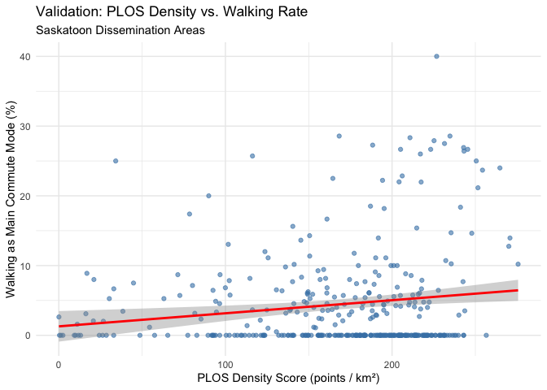
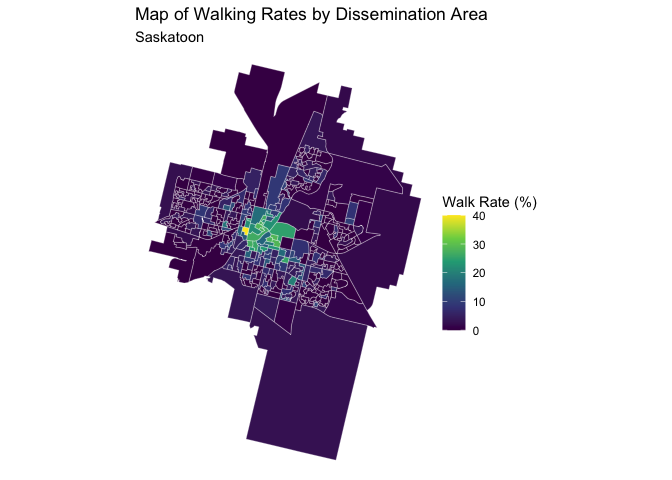

---
output:
  html_document:
    keep_md: true
---

# Walk Rate Validation


``` r
# Load the required Libraries 
library(readxl)
library(dplyr)
```

```
## 
## Attaching package: 'dplyr'
```

```
## The following objects are masked from 'package:stats':
## 
##     filter, lag
```

```
## The following objects are masked from 'package:base':
## 
##     intersect, setdiff, setequal, union
```

``` r
library(sf)
```

```
## Linking to GEOS 3.13.0, GDAL 3.8.5, PROJ 9.5.1; sf_use_s2() is TRUE
```

``` r
library(ggplot2)
```


## 1. File Paths 


``` r
da_path <- "/Users/patysalazar/Desktop/MSc/PLOS/lda_000b21a_e/lda_000b21a_e.shp"
final_data_path <- "/Users/patysalazar/Desktop/MSc/PLOS/FINAL.xlsx"
```

## 2. Load Data 
### Load the DA polygons for Saskatchewan


``` r
da_poly <- st_read(da_path, quiet = TRUE) |>
  filter(PRUID == "47") # Filter for Saskatchewan
```

### Load the final scores from the Excel file


``` r
final_scores <- read_excel(final_data_path) |>
  mutate(DAUID = as.character(DAUID))
```

## 3. Spatial Join Data with Scores 
### This join adds the scores (plos_density, walk_rate) to the geographic shapes


``` r
da_map_final <- left_join(da_poly, final_scores, by = "DAUID") |>

# Remove DAs that didn't have a score to avoid empty areas on the map
  filter(!is.na(plos_density))
```
  
## 4. Create the Validation Scatter Plot 


``` r
validation_plot <- ggplot(da_map_final, aes(x = plos_density, y = walk_rate * 100)) +
  geom_point(alpha = 0.6, color = "steelblue") +
  geom_smooth(method = "lm", color = "red") + 
  theme_minimal() +
  labs(
    title = "Validation: PLOS Density vs. Walking Rate",
    subtitle = "Saskatoon Dissemination Areas",
    x = "PLOS Density Score (points / km²)",
    y = "Walking as Main Commute Mode (%)"
  )
print(validation_plot)
```

```
## `geom_smooth()` using formula = 'y ~ x'
```

<!-- -->

## 5. Create Walk Rates Map


``` r
walk_rate_map <- ggplot(da_map_final) +
  geom_sf(aes(fill = walk_rate * 100), color = "white", size = 0.1) +
  scale_fill_viridis_c(name = "Walk Rate (%)") +
  theme_void() +
  labs(
    title = "Map of Walking Rates by Dissemination Area",
    subtitle = "Saskatoon"
  )
print(walk_rate_map)
```

<!-- -->

